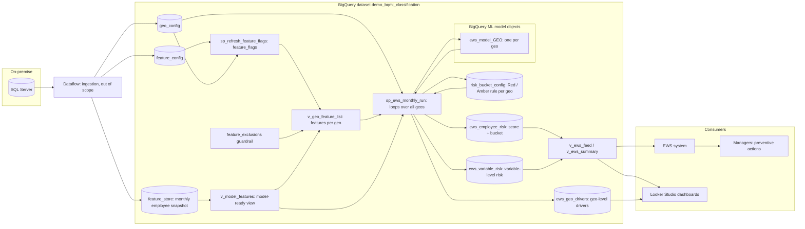
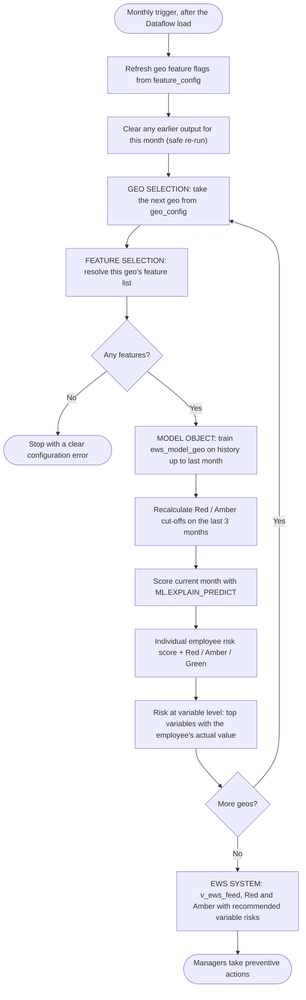
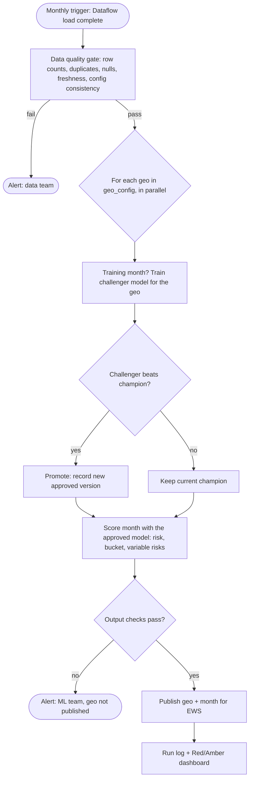

# Employee Risk Classification for the Early Warning System (EWS) on BigQuery ML
### Proposal, Solution Design and Verification Approach: moving the Model Sandbox from SQL Server + custom Python to BigQuery ML

---

## 1. Executive Summary

Today the **Model Sandbox** runs on an on-premise **SQL Server** database with **custom Python code**. Each month it:

1. Loops through the geos one at a time, using history up to and including last month.
2. Picks each geo's features from a feature store of 600+ features, as set in a feature config.
3. Scores every employee for the current month, places them in **Red / Amber** buckets and calculates **risk at variable level**.
4. Sends the recommended variable risks to the **EWS system**, so managers can take preventive action.

This document shows how **the same process runs entirely inside Google BigQuery with BigQuery ML (BQML)**, driven by **the same `geo_config` and `feature_config` files**. It also shows how every step is verified. The approach was built and run end to end on the synthetic sample you provided.

| Your Model Sandbox today | With BigQuery ML |
|---|---|
| Python loops over geos | One SQL stored procedure loops over `geo_config` |
| Python selects the features for each geo | Features are resolved automatically from `feature_config`, with a guardrail that blocks IDs, labels and constants |
| Pickled model objects on a server | A **BigQuery ML model object** per geo, stored in BigQuery with its training history |
| Python code for scoring, Red/Amber logic and variable risk | `ML.EXPLAIN_PREDICT` returns the risk score and **each variable's contribution** in one step. Red/Amber comes from a business-owned config table |
| Extracts and file hand-offs to EWS | EWS reads a ready-made BigQuery view |
| Manual checks after each run | **63 automated tests plus 4 business scenarios**, each returning *expected vs observed* and PASS / FAIL |
| Servers, Python environments, libraries | Serverless: nothing to install, patch or scale |

**Scope:** data ingestion from SQL Server into BigQuery is handled by **Dataflow** and is outside the scope of this document. We assume the feature store and both config tables are **already in BigQuery**. The focus is the **classification model**: building, validating, scoring, explaining, publishing to EWS, and verifying.

**How to use this document to decide:** §11 (*Decision Guide*) lists each of your requirements, how BigQuery ML meets it, and the demo evidence behind it. It separates what the demo **has proven** from what only your real data can prove, and gives the go / no-go criteria for the parallel run.

---

## 2. Your Process Mapped to BigQuery ML

The mapping follows the four stages in the *Model Sandbox – Working Details* slide:

| Sandbox stage | What it does today | BigQuery ML implementation |
|---|---|---|
| **Geo Selection** | 9 geos are scored one at a time on history including last month. The loop repeats until every geo is done. Driven by `Geo Config.csv`. | Table `geo_config`. The stored procedure `sp_ews_monthly_run` runs `FOR g IN (SELECT GEO FROM geo_config)`. The training window is every month **before** the scoring month, so last month is included. |
| **Feature Selection** | A feature store with 600+ features. Each geo's features are chosen from `Feature Config.csv`. | Tables `feature_store` (loaded by Dataflow) and `feature_config`. The procedure `sp_refresh_feature_flags` reads the config, and the view `v_geo_feature_list` resolves the exact feature list for each geo. Changing the config needs no code change. |
| **Model Object** | The model object scores the current month: each employee's risk score, a Red & Amber bucket, and risk at variable level. | One model object per geo, `ews_model_<geo>` (Boosted Tree). `ML.EXPLAIN_PREDICT` gives the **risk score** and the **contribution of each variable**. The table `risk_bucket_config` sets the **RED / AMBER / GREEN** rule for each geo. |
| **EWS System** | Recommended variable risks are sent to EWS, and managers take preventive action. | Tables `ews_employee_risk`, `ews_variable_risk` and `ews_geo_drivers`. The view `v_ews_feed` lists Red & Amber employees with their top 5 variable risks, ready for EWS. |

---

## 3. Why BigQuery ML

| Challenge with SQL Server + custom Python | How BigQuery ML addresses it |
|---|---|
| **Moving data to the model.** HR data is extracted into Python, which creates copies outside the database. | The model goes to the data. Training, scoring and explanation run **inside BigQuery** on one governed copy. |
| **Code paths per geo.** 9 geos with different feature sets means branching code to maintain. | One SQL loop is driven by `geo_config` and `feature_config`. Adding a geo or changing a feature means editing config rows. This is demonstrated in scenarios M1 and M2 (§8.3). |
| **600+ features × many geos × monthly history.** Server memory and runtime grow with the data. | BigQuery is serverless and scales automatically. The same SQL runs on 5 thousand or 500 million rows. |
| **Variable-level risk** needs custom code (for example SHAP). | It is built in. `ML.EXPLAIN_PREDICT` returns each variable's contribution to each employee's score. |
| **Model objects** are files on disk with manual versioning. | Models are BigQuery objects with training history and metadata. They can optionally be registered in the Vertex AI Model Registry. |
| **Operations.** Scheduling, re-runs, error handling and checks are hand-built. | BigQuery offers scheduled queries and re-runnable procedures. Configuration errors stop the run before any training. Automated test queries and audit logs are included. |
| **Skills.** The work needs Python ML specialists. | Anyone who knows SQL can build and run the models. |

---

## 4. Sample Package: What Was Provided

### 4.1 Files

| File | Description (from `Read_me.xlsx`) | Observed content |
|---|---|---|
| `geo_config.csv` | Geo selection config file | 7 geos: **ULK, KAS, JEM, PHY, MEY, JYZ, SFY** (masked codes) |
| `feature_config.csv` | Feature config used for feature selection | 100 features × 7 geos. A 1/0 flag says whether a feature is used for a geo |
| `Model_Data.csv` | Synthetic model data with 7 geos' details, in line with the feature config and geo config | 5,000 rows × 100 columns. Label `target`: 0 = 3,238, 1 = 1,762 (**35.2% positive**). Monthly snapshots (`YEAR_MONTH`) from **2024-01 to 2026-09** (33 months). The latest month, 2026-09, has 149 employees |
| `Model Sandbox – Working Details.pptx` | Process overview | The four stages summarised in §2 |

> [!NOTE]
> **Sample vs production scale:** the sample has 7 geos and 100 features. Production has 9 geos and 600+ features. The design is driven by config, so it scales without code changes.

### 4.2 Column profile of `Model_Data.csv`

| Column group | Count | Examples | Treatment |
|---|---|---|---|
| Numeric measures | 64 | `EMP_AGE_YEARS`, `DAYS_AFTER_JOIN`, `EMP_PI_SCORE_INLAST_*`, `EMP_LEAVE_*`, `EMP_PRESENT_*`, `TOTAL_LOGGED_HOURS_*`, `TOTAL_*_TAFS_*` | Used directly |
| Categorical | 6 | `EMP_VENDOR_FLG`, `EMP_GENDER`, `EMP_LEVEL`, `EMP_PROGRAM_ROLE`, `EMP_LOCATION_CODE`, `EMP_MARITAL_STATUS` | Encoded automatically by BQML |
| Dates (`m/d/yyyy h:mm`) | 10 | `EMP_ACTION_DATE`, `DV_EMP_RECENT_DATE_JOINING`, `DV_EMP_COMPANY_SENIORITY_DATE`, … | Converted to **days before the snapshot month-end**, so they act as recency and tenure signals |
| Keys and identifiers | 7 | `YEAR_MONTH`, `DV_EMP_MTH_YEAR_MONTH`, `EMP_ID`, `EMP_PROJECT_ID`, `EMP_SUPERVISOR_ID`, `EMP_SUB_PROGRAM_ID`, `EMP_PROJECT_MANAGER_ID` | Kept for joins and reporting. Not used as model inputs |
| Near-unique text codes | 8 | `EMP_STATE`, `EMP_DESIGNATION`, `EMP_COMPANY`, `EMP_TYPE`, `EMP_VERTICAL`, `EMP_LAST_ACTION`, `EMP_LAST_ACTION_REASON`, `DV_EMP_DOJ` | Not used as inputs: with 3,800+ distinct values in 5,000 rows they give no signal that generalises |
| Constant columns | 4 | `EMP_REGULAR_TEMP`, `EMP_JOB_CODE`, `EMP_MEDIUM`, `EMP_TEAM_CODE` | Not used as inputs: each holds a single value |

### 4.3 Geo feature profiles (from `feature_config.csv`)

| Profile | Geos | Features flagged | Model inputs used* | What differs |
|---|---|---|---|---|
| **A: HR attributes** | ULK, KAS, JEM | 59 | **41** | Includes `EMP_LAST_PROMO_NONPROMO_DURATION`. Has no workforce-telemetry columns and no `EMP_LEVEL`. |
| **B: HR + workforce telemetry** | PHY, MEY, JYZ, SFY | 93 | **75** | Adds 34 `TOTAL_*` telemetry measures (logged hours, short breaks, idle time, lunch/dinner, training, coaching, downtime) and `EMP_LEVEL`. |

\*The config also flags the label, keys, identifiers, near-unique codes and constants with `1`. A small **exclusion guardrail** (§7.3, §7.4) keeps these out of the model inputs automatically. Tests T204 and T305 prove it.

These features are switched off for every geo in the config: `EMP_KM_ONEWAY`, `EMP_LOCATION_CODE`, `EMP_PI_SCORE_INLAST_MONTH`, `EMP_STATE`, `EMP_MARITAL_STATUS`, `EMP_TEAM_CODE`.

---

## 5. Target Architecture



**Key design decisions**

| Decision | Rationale |
|---|---|
| **Boosted Tree classifier (XGBoost) in BigQuery ML** as the model object | Strong on tabular HR data that mixes numeric and categorical inputs. It captures non-linear effects and gives exact per-variable contributions. |
| **Logistic Regression as a benchmark** during validation | A transparent baseline that the primary model must beat. |
| **One model per geo, driven by config** | Mirrors your Geo Selection → Feature Selection → Model Object flow exactly. |
| **Train on history including last month, score the current month** | Matches your sandbox. The last 3 months of history act as the validation window, used for early stopping and Red/Amber calibration. |
| **Red / Amber rule held per geo in a business-owned table** | Default: **RED = top 10%** of risk scores and **AMBER = next 20%**, recalculated every month on the validation window. Any geo can be switched to **fixed cut-offs** with one config change. |
| **Automatic class weighting** | The label is imbalanced (35% / 65%). |
| **Dates converted to "days before snapshot"** | Raw dates become recency and tenure signals. Column names stay the same, so `feature_config` still maps 1:1. |
| **Fail fast on configuration errors** | If a geo resolves to no features, the run stops with a clear message before any model is trained (scenario M4). |
| **Re-runnable by design** | Re-running a month replaces that month's output and never duplicates it (scenario M3). |

---

## 6. End-to-End Flow



Before go-live, a **one-time validation (backtest)** proves accuracy and sets the Red/Amber cut-offs on data the model has never seen:

| Split (sample data) | Months | Rows | Positives | Purpose |
|---|---|---|---|---|
| TRAIN | 2024-01 → 2025-12 | 3,649 | 1,289 | Model fitting |
| EVAL | 2026-01 → 2026-05 | 749 | 279 | Early stopping and Red/Amber calibration |
| TEST | 2026-06 → 2026-09 | 602 | 194 | Untouched hold-out used for the reported accuracy |

---

## 7. Implementation

The implementation is delivered as a **package of SQL scripts**, shared separately. Every script runs in **BigQuery Studio**: paste it, click **Run** once, and it runs from start to finish. No Python, servers or extra tools are needed. The pilot dataset is **`demo_bqml_classification`** in **`us-central1`**.

> [!IMPORTANT]
> **Replace the project placeholder before running.** The scripts refer to every object as `` `YOUR_PROJECT_ID.demo_bqml_classification.<object>` ``, and the data-load commands (Appendix B) use `YOUR_PROJECT_ID` too. Before running anything, replace **every** occurrence of `YOUR_PROJECT_ID` with the ID of the Google Cloud project where the demo will run. Use **Find and replace (Ctrl+H) → Replace all** in the BigQuery Studio editor, or run `sed -i 's/YOUR_PROJECT_ID/<your-project-id>/g' sql/*.sql` once from the package folder in Cloud Shell. If any placeholder is left, the script stops with a "project not found" or access error, and nothing is created. The dataset name and region can stay as they are.

### 7.1 Script package and run order

| Step | Script | What it does | Runtime (sample) | Checkpoint |
|---|---|---|---|---|
| 0 | `00_create_dataset` + Cloud Shell `bq load` | Creates the dataset and loads the feature store and both configs from Cloud Shell, using explicit schema files (Appendix B) | ~5 min | **T1** |
| 1 | `01_shared_objects` | Date helper, model-ready view, feature-flag procedure, guardrail, per-geo feature list, Red/Amber config, EWS output tables | ~1 min | **T2** |
| 2a | `02a_backtest_train` | Trains 14 validation models (7 geos × Boosted Tree + Logistic Regression) | 30–60 min | — |
| 2b | `02b_backtest_evaluate` | Measures accuracy on the unseen TEST months | ~3 min | — |
| 2c | `02c_backtest_calibrate_buckets` | Sets Red / Amber cut-offs per geo on the EVAL months | ~3 min | — |
| 2d | `02d_backtest_capture` | Business view: how many real events Red / Amber caught | ~3 min | **T3** |
| 2e | `02e_backtest_explain` | Explainability: drivers, direction of effect, training curve, threshold trade-off | ~1 min | — |
| 3a | `03a_create_monthly_procedure` | Creates `sp_ews_monthly_run`, the production Model Sandbox | seconds | — |
| 3b | `03b_call_monthly_procedure` | Runs the monthly job for **2026-09** | 20–35 min | **T4** |
| 4 | `04_ews_views` | EWS feed and management summary, plus the top-20 action list | seconds | **T5** |
| — | `M1`–`M4` | Business scenarios (§8.3) | 1–35 min | built in |
| — | `98_optional_scheduled_query` | How to schedule the monthly run | — | — |
| — | `99_cleanup` | Removes the pilot dataset | seconds | — |

> [!NOTE]
> Runtimes are for the sample. Models train one geo after another, so total time grows with the number of geos, not with data volume. At production scale the geos can run in parallel if needed.

### 7.2 BigQuery ML in five minutes (for first-time users)

BigQuery ML lets you **train, evaluate and use machine-learning models with SQL**, inside the database where the data already lives. If you know SQL Server and Python, most concepts map directly:

| BigQuery term | What it is | Closest equivalent today |
|---|---|---|
| **Project** | The Google Cloud container for billing, security and all resources | Your SQL Server instance / subscription |
| **Dataset** | A folder of tables, views, procedures and models, in one region (here `us-central1`) | A SQL Server database or schema |
| **Table / View** | Stored data, or a saved query that behaves like a table | Same as SQL Server |
| **Script** | Several SQL statements run together as one job, with variables (`DECLARE`), loops (`FOR`) and conditions (`IF`) | A T-SQL batch |
| **Stored procedure** | A script saved in the dataset under a name and run with `CALL` | A SQL Server stored procedure |
| **Job / child job** | Each run is a job; each statement inside a script is a child job, visible in **Job history** with its duration, data processed and any error | SQL Agent job history |
| **BigQuery ML model** | A trained model saved as an object in the dataset, next to the tables | The pickled model file produced by Python |
| `CREATE MODEL` | Trains a model from the result of a `SELECT` | `model.fit(X, y)` |
| `ML.EVALUATE` | Accuracy metrics (AUC, precision, recall, …) on the data you pass in | `sklearn.metrics` |
| `ML.PREDICT` | Scores new rows and returns the predicted class and probabilities | `model.predict_proba(X)` |
| `ML.EXPLAIN_PREDICT` | Scores new rows **and** returns each variable's contribution to each score | `predict_proba` + SHAP |
| `ML.GLOBAL_EXPLAIN` | Overall importance of each variable for the model | Feature importance |
| `ML.FEATURE_INFO` / `ML.TRAINING_INFO` | Which inputs the model used / loss per training iteration | Inspecting `X.columns` / training logs |
| `ML.ROC_CURVE` / `ML.WEIGHTS` | Precision-recall at every cut-off / coefficients of a linear model | `roc_curve` / `model.coef_` |
| **Boosted Tree classifier** | Gradient-boosted decision trees (XGBoost) | `xgboost.XGBClassifier` |

Things that are different, and simpler:
- **No data movement.** The model is trained where the data is. Nothing is exported to a Python server.
- **No infrastructure.** There are no servers, libraries or environments to manage. BigQuery allocates compute for each statement and releases it afterwards.
- **Categorical columns are encoded automatically.** Nulls and scaling are handled automatically too.
- **Everything is logged.** Every statement, including model training, appears in Job history, so you can see what ran, when, and for how long.

### 7.3 Script-by-script guide: what each script does and why it is needed

Scripts are numbered in run order. Every SQL script is **safe to re-run**: if something fails, fix the cause and run the same script again. (The one exception is the data load: `bq load` appends, so to reload a file add `--replace` to the command.)

**`00_create_dataset` + Cloud Shell `bq load`: set up the workspace and bring in the data**
- *What it does:* Creates the dataset `demo_bqml_classification` in `us-central1`. Then loads `Model_Data.csv`, `feature_config.csv` and `geo_config.csv` into the tables `feature_store`, `feature_config` and `geo_config`.
- *Why it is needed:* Everything that follows (views, models, outputs) lives in this dataset. The schema files fix each column's type (number, text), so the data reads the same way every time. In production, Dataflow performs this load from SQL Server.
- *What you will see:* Three new tables in the Explorer panel. Run **T1** to confirm the data arrived complete.

**`01_shared_objects`: prepare the data and the configuration the models depend on**
- *What it does:* Creates the building blocks used by every later step:
  - a helper that reads dates in any format;
  - `v_model_features`, the model-ready view, which turns dates into "days before the snapshot";
  - `sp_refresh_feature_flags`, which turns `feature_config` into a list of (feature, geo, on/off);
  - `feature_exclusions`, the list of columns that must never be used;
  - `v_geo_feature_list`, the final features per geo;
  - `risk_bucket_config`, the Red/Amber rule;
  - the three empty EWS output tables.
- *Why it is needed:* This is the **Feature Selection** stage of your sandbox, expressed once, in SQL. Models read features through the view, so data preparation is identical in validation and in production. Because the feature list comes from config, the same code serves every geo.
- *What you will see:* A small table showing the number of features per geo (41 or 75). Run **T2**.

**`02a_backtest_train`: train candidate models on past data**
- *What it does:* For every geo, trains two models on 2024-01 → 2025-12 and uses 2026-01 → 2026-05 to decide when to stop training:
  - a **Boosted Tree** (the proposed production model);
  - a **Logistic Regression** (a simple benchmark).
- *Why it is needed:* Before trusting a model in production, we must show how it performs on months it has never seen. The benchmark shows whether the more powerful model earns its place.
- *What you will see:* 14 model objects (`bt_btree_<geo>`, `bt_logreg_<geo>`) appear in the dataset. Click one to see its training details, inputs and evaluation tabs.

**`02b_backtest_evaluate`: measure accuracy on unseen months**
- *What it does:* Runs `ML.EVALUATE` for all 14 models on the TEST months (2026-06 → 2026-09) and stores the results in `bt_eval_results`.
- *Why it is needed:* This is the objective, like-for-like accuracy evidence (AUC, precision, recall) that you would compare with the current Python model.
- *What you will see:* One row per geo and model type. §8.4 explains how to read AUC.

**`02c_backtest_calibrate_buckets`: set the Red / Amber cut-offs**
- *What it does:* Scores the validation months and finds, for each geo, the score above which an employee is in the top 10% (RED) and in the next 20% (AMBER). Saves these cut-offs in `risk_bucket_config`.
- *Why it is needed:* A model gives a probability. Managers need a clear action category. Setting cut-offs on validation data, not on the test months, keeps the evaluation honest.
- *What you will see:* The Red and Amber cut-off per geo.

**`02d_backtest_capture`: accuracy in business terms**
- *What it does:* Scores the TEST months and counts, for each geo and bucket, how many employees were flagged and how many of them actually had the event.
- *Why it is needed:* Managers care less about AUC than about "if I act on RED, how often am I right, and how many cases do I catch?". This table answers that. Run **T3** afterwards.
- *What you will see:* The hit rate and share of events per RED / AMBER / GREEN bucket.

**`02e_backtest_explain`: understand what drives risk**
- *What it does:* Read-only queries showing:
  - the most influential variables per geo;
  - whether each variable raises or lowers risk;
  - the training curve;
  - the precision/recall trade-off at different cut-offs.
- *Why it is needed:* It builds trust. HR can check that the drivers make business sense, and that the model is not relying on something it shouldn't.
- *What you will see:* Five result sets. Click **View results** for each.

**`03a_create_monthly_procedure`: save the production Model Sandbox**
- *What it does:* Saves `sp_ews_monthly_run(scoring_month)` in the dataset. It does **not** run it yet. For each geo in `geo_config`, the procedure:
  1. resolves the features;
  2. trains the production model on all history up to last month;
  3. recalculates the Red/Amber cut-offs;
  4. scores the current month with explanations;
  5. writes the EWS output tables.
- *Why it is needed:* This one procedure **replaces the monthly Python sandbox**. Because it is saved under a name, a scheduler can run it every month with a single `CALL`.
- *What you will see:* The procedure appears under **Routines** in the dataset.

**`03b_call_monthly_procedure`: run the monthly job**
- *What it does:* `CALL sp_ews_monthly_run(202609)` scores September 2026, the latest month in the sample.
- *Why it is needed:* It produces the actual EWS output: individual risk scores, Red/Amber/Green, variable-level risks and geo-level drivers.
- *What you will see:* The results pane lists every step the procedure executed. Seven production models (`ews_model_<geo>`) appear, and the three `ews_*` tables are populated. Run **T4**.

**`04_ews_views`: publish to EWS and managers**
- *What it does:* Creates `v_ews_feed` (Red and Amber employees with their top 5 variable risks) and `v_ews_summary` (counts per geo and month). Then shows the top-20 employees to act on.
- *Why it is needed:* EWS and dashboards should read a stable, simple view rather than the internal tables. The view is the **contract** with the EWS system. Run **T5**.
- *What you will see:* A ranked list of employees with plain-language reasons such as `EMP_LEAVE_INLAST_MONTH = 58 (+0.22)`.

**`T1`–`T5`: automated checks after each phase**
- *What they do:* Each is a single query that returns one row per test, with *expected*, *observed* and **PASS / FAIL / INFO**.
- *Why they are needed:* They prove that each phase worked before you move on, and they replace manual spot checks. They can also be re-run any month as a health check.

**`M1`–`M4`: business scenarios**
- *What they do:* Simulate real situations: a feature switched off, a new geo, a re-run, and a configuration mistake. Each checks the result, and M1, M2 and M4 then undo their changes.
- *Why they are needed:* They show that day-to-day changes are handled **by configuration, not code**, and that the process is safe to operate (§8.3).

**`98_optional_scheduled_query`: automate the monthly run** *(not enabled in the pilot)*
- *What it does:* Documents how to create a BigQuery **scheduled query** that calls the procedure every month for the month that just closed.
- *Why it is needed:* In production, the run should start automatically after the monthly data load. It is left off in the pilot because the sample data does not change.

**`99_cleanup`: remove the pilot**
- *What it does:* Deletes the dataset and everything in it: tables, views, models and procedures.
- *Why it is needed:* It stops storage costs once the pilot is over, and leaves the project clean. It is irreversible, so run it only at the end.

### 7.4 What each layer does (technical detail)

**Feature Selection (Step 1)**
- `v_model_features` is the model-ready view over the feature store. It converts the 10 date columns to *days before the snapshot month-end* and keeps the original column names.
- `sp_refresh_feature_flags` reshapes `feature_config` into (feature, geo, flag). It reads the geo list from `geo_config`, so a new geo needs **no code change**. Every monthly run calls it, so config edits take effect automatically.
- `feature_exclusions` is a guardrail listing columns that must never be model inputs, even if flagged: the label, keys, identifiers, near-unique codes and constants.
- `v_geo_feature_list` builds the final list for each geo: features that are **flagged, present in the data, and not excluded**. On the sample this gives 41 features for Profile A geos and 75 for Profile B.

**Model Object (Steps 2 and 3)**, per geo:

```sql
FOR g IN (SELECT GEO FROM geo_config ORDER BY GEO) DO             -- GEO SELECTION
  SET features = (SELECT feature_list FROM v_geo_feature_list
                  WHERE geo = g.GEO);                             -- FEATURE SELECTION
  EXECUTE IMMEDIATE FORMAT("""
    CREATE OR REPLACE MODEL ews_model_%s
    OPTIONS (model_type = 'BOOSTED_TREE_CLASSIFIER', input_label_cols = ['target'],
             auto_class_weights = TRUE, early_stop = TRUE, enable_global_explain = TRUE, ...)
    AS SELECT target, %s FROM v_model_features WHERE YEAR_MONTH < <scoring month> ...
  """, LOWER(g.GEO), features);                                   -- MODEL OBJECT
  ...
END FOR;
```

- **`FOR ... DO ... END FOR`** is BigQuery procedural SQL. BigQuery runs the whole script server-side, one statement after another. Every statement is logged as a child job you can inspect.
- **`EXECUTE IMMEDIATE`** builds each geo's statement with that geo's own feature list. This is how one piece of code serves every geo.

**Red / Amber rule (`risk_bucket_config`)**

| Column | Default | Meaning |
|---|---|---|
| `method` | `PERCENTILE` | `PERCENTILE` means cut-offs are recalculated every month. `FIXED` means the business enters the cut-offs |
| `red_top_pct` / `amber_next_pct` | 10 / 20 | RED = top 10% of risk scores, AMBER = the next 20% |
| `red_threshold` / `amber_threshold` | set by the run | The actual score cut-offs used for the month. Entered by hand when `method = FIXED` |

The percentile rule keeps Red / Amber volumes stable and in line with what managers can act on, whatever the model's calibration. If the sandbox today uses fixed cut-offs or precision/recall targets, those can be replicated (§14, item 4).

**Individual and variable-level risk (Step 3)**
- `ML.EXPLAIN_PREDICT` returns, for every employee, the **risk score** (probability of `target = 1`) and the **top 10 variables** with their contribution.
- Contributions are expressed consistently as **"towards risk"**. Only variables that **increase** an employee's risk are kept as recommended variable risks.
- Each variable risk carries the **employee's actual value** for that variable (for example `EMP_LEAVE_INLAST_MONTH = 58`), so managers see *what* to act on.
- `ews_geo_drivers` stores each geo's overall top drivers for the month, for HR leadership trends.

**EWS System (Step 4)**
- `v_ews_feed` has one row per RED / AMBER employee: score, bucket, rank within the geo, and an ordered list of the **top 5 recommended variable risks**.
- `v_ews_summary` gives employees scored and Red / Amber / Green counts per geo and month.

Example of what EWS receives for one employee (illustrative):

| geo | EMP_ID | risk_score | risk_bucket | rank | recommended_variable_risks (feature = value → contribution) |
|---|---|---|---|---|---|
| PHY | E4xxxxx | 0.83 | RED | 1 | 1. `EMP_PI_SCORE_INLAST_3_MONTHS` = 12.4 → +0.41 · 2. `EMP_LEAVE_INLAST_MONTH` = 58.1 → +0.22 · 3. `TOTAL_IDLE_TIME` = 5 → +0.12 … |

**How EWS consumes the output** (choose one):
- EWS reads `v_ews_feed` directly through the BigQuery ODBC/JDBC driver or the BigQuery API.
- A small Dataflow job, reusing the existing ingestion setup, writes `v_ews_feed` back to the EWS database.
- Looker Studio or Connected Sheets on `v_ews_summary`, for managers and HR leadership.

### 7.5 Operating model

| Need | How it is handled |
|---|---|
| **Monthly schedule** | A BigQuery scheduled query runs on e.g. the 3rd of each month, after the Dataflow load, and scores the month that just closed: `CALL sp_ews_monthly_run(<previous month>)`. It is not enabled in the pilot because the sample data is static. |
| **Re-run a month** | Call the procedure again. The month's output is replaced, never duplicated (M3). |
| **Add or remove a feature for a geo** | Edit `feature_config`. It takes effect on the next run with no code change (M1). |
| **Onboard a new geo** | Add a column to `feature_config`, a row to `geo_config` and a row to `risk_bucket_config` (M2). |
| **Wrong configuration** | The run stops with a clear message before training anything (M4). |
| **Model versioning** | Each month's model object is kept in BigQuery. Optionally, `model_registry = 'VERTEX_AI'` versions every model in the Vertex AI Model Registry. |

---

## 8. Verification: Test Scenarios and How to Read the Results

### 8.1 Approach

Verification is built into the delivery. After each phase, a **test script** runs, and every test returns one row:

| Column | Meaning |
|---|---|
| `test_id` | Reference, e.g. T401 |
| `scenario` | What is being checked |
| `expected` | The value the design guarantees for the sample data |
| `observed` | The value actually found in BigQuery |
| `status` | **PASS** (observed matches expected), **FAIL** (investigate before continuing), or **INFO** (a measured value for review with no pass mark, e.g. model accuracy) |

There are **5 automated checkpoints (T1–T5, 63 tests)** and **4 business scenarios (M1–M4)**. The scenarios show how the solution behaves when the business changes something. M1, M2 and M4 restore the dataset to its original state when they finish.

```mermaid
flowchart LR
    L["Load data"] --> T1["T1: data as received"]
    T1 --> S["Shared objects"] --> T2["T2: feature selection + splits"]
    T2 --> B["Backtest"] --> T3["T3: models + Red/Amber"]
    T3 --> P["Monthly run"] --> T4["T4: EWS outputs"]
    T4 --> V["EWS views"] --> T5["T5: EWS feed"]
    T5 --> M["M1-M4: business scenarios"]
```



### 8.2 Automated checkpoints

#### Checkpoint T1: data as received (after loading)

| ID | What is checked | Expected | How to read it |
|---|---|---|---|
| T101 | feature_store rows | 5000 | The full file loaded, with no rows dropped |
| T102 | feature_store columns | 100 | All columns present |
| T103 | Label split (0 / 1) | 3238 / 1762 | The label loaded correctly, 35.2% positive |
| T104 | Rows with no label | 0 | Every historical row can be used for training |
| T105 | Month range | 202401 - 202609 (33) | Full history is available |
| T106 | Key column types | INT64, INT64, STRING, STRING | Columns kept their intended types. Auto-detection was avoided on purpose |
| T107 | Duplicate employee-month keys | 1 | **Known data issue** in the synthetic file (E777899 in 2025-04). It is reported, not hidden. See §9 |
| T108 | Employees in the scoring month 2026-09 | 149 | The population to be scored |
| T109 | feature_config rows | 100 | The config matches the data |
| T110 | Geos in geo_config | 7: JEM,JYZ,KAS,MEY,PHY,SFY,ULK | Geo selection input is correct |
| T111 | Geos with no column in feature_config | 0 | Every geo has a feature definition |
| T112 | Configured features missing from the data | 0 | The config and the feature store are aligned |

#### Checkpoint T2: feature selection and data preparation

| ID | What is checked | Expected | How to read it |
|---|---|---|---|
| T201 | Feature flags (100 × 7) | 700 | The config was reshaped completely |
| T202 | Flags set to 1 | 549 | Matches `feature_config` exactly |
| T203 | Features resolved per geo | A-geos 41, B-geos 75 | **Feature Selection works per geo**, straight from the config |
| T204 | Excluded columns in any feature list | 0 | **Guardrail works:** IDs, the label and constants never reach a model |
| T205 | Telemetry (TOTAL_*) features per geo | A 0, B 34 | Profile differences are honoured |
| T206 | Rows in the model-ready view | 5000 | No rows lost in preparation |
| T207 | Dates that failed to convert | 0 | All 10 date columns are usable |
| T208 | Type of a converted date | INT64 | Dates are now "days before snapshot" |
| T209 | EMP_ACTION_DATE later than its snapshot month | 1726 | **Known data issue** (see §9). It matters for leakage and must be confirmed with you |
| T210 | Split sizes | TRAIN 3649 / EVAL 749 / TEST 602 | Time-based split with no overlap |
| T211 | Positives per split | 1289 / 279 / 194 | Every split contains enough events |
| T212 | Red/Amber defaults | 7 rows, PERCENTILE, top 10%, next 20% | Business rule in place for every geo |
| T213 | EWS output tables | 3 | Ready for the monthly run |

#### Checkpoint T3: validation models and Red / Amber (backtest)

| ID | What is checked | Expected | How to read it |
|---|---|---|---|
| T301 | Models evaluated | 14 | Two model families were trained for every geo |
| T302 | Models with a valid AUC | 14 | Every model produced a usable result |
| T303 | Average TEST AUC, Boosted Tree vs Logistic Regression | INFO | Ranking quality on unseen months. See §8.4 for how to interpret it |
| T304 | Inputs per model | PHY 75, ULK 41 | **Each model used exactly its geo's configured features** |
| T305 | Excluded columns used as inputs | 0 | Guardrail confirmed at model level |
| T306 | Telemetry inputs, ULK vs PHY | 0 / 34 | Profile A vs B confirmed at model level |
| T307 | TEST predictions | 4214 | 602 TEST rows scored by each of the 7 geo models |
| T308 | Scores missing or outside 0–1 | 0 | Valid probabilities |
| T309 | Score spread (std dev) | > 0.001 | The model separates employees rather than giving everyone the same score |
| T310 | Geos with valid cut-offs (0 < Amber < Red < 1) | 7 | The Red/Amber calibration succeeded |
| T311 | RED share of TEST employees | 3%–20% (target 10%) | Red volume stays near the agreed level on unseen months |
| T312 | AMBER share | 10%–35% (target 20%) | Same for Amber |
| T313 | Actual event rate: RED / AMBER / GREEN | INFO | **Key business measure.** RED should be higher than GREEN (§8.4) |
| T314 | Training iterations (early stopping) | 1–100 | Training stopped when validation stopped improving, which guards against over-fitting |

#### Checkpoint T4: monthly Model Sandbox run (2026-09)

| ID | What is checked | Expected | How to read it |
|---|---|---|---|
| T401 | Employee risk rows | 1043 | 149 employees × 7 geo models. The sample has no GEO column; see §9, item 1 |
| T402 | Rows per geo | 7 geos × 149 | **Geo Selection** looped over every geo |
| T403 | Scores missing or outside 0–1 | 0 | Valid individual risk scores |
| T404 | Bucket inconsistent with the geo's cut-offs | 0 | Red/Amber/Green applied exactly as configured |
| T405 | RED share | 3%–20% | Red volume is actionable |
| T406 | AMBER share | 10%–35% | Amber volume is actionable |
| T407 | Variable risks that do not increase risk | 0 | Only risk-raising variables are recommended |
| T408 | Variable risks on a feature outside the geo's list | 0 | Explanations only use that geo's configured features |
| T409 | Variable risks without the employee's value | 0 | Every recommendation shows the actual value |
| T410 | Driver ranks | 1 to ≤ 10 | Ranked top-10 explanation per employee |
| T411 | Telemetry drivers for ULK (Profile A) | 0 | Profile A never gets telemetry-based recommendations |
| T412 | Production model inputs | PHY 75, ULK 41 | Production models follow the config |
| T413 | Geos with overall drivers stored | 7 | Geo-level trends are available to HR leadership |
| T414 | Geos with cut-offs recalculated by this run | 7 | Red/Amber refreshed on the latest validation window |
| T415 | RED employees without a reason | 0 | **Every RED flag comes with at least one explanation** |
| T416 | Actual event rate in 2026-09: RED / AMBER / GREEN | INFO | The sample has 2026-09 outcomes, so we can check the ranking against reality (§8.4) |
| T417 | Temporary working table removed | 0 | The run cleans up after itself |

#### Checkpoint T5: EWS feed

| ID | What is checked | Expected | How to read it |
|---|---|---|---|
| T501 | Feed rows = RED + AMBER employees | equal | EWS receives exactly the flagged population |
| T502 | Other buckets in the feed | 0 | GREEN employees are never pushed to managers |
| T503 | Feed rows with no or too many variable risks | 0 | Each flagged employee has 1–5 recommendations |
| T504 | First recommendation is the top driver | 0 violations | Recommendations are ordered by impact |
| T505 | Employees in the summary | 1043 | Summary reconciles to the scoring output |
| T506 | Summary Red + Amber = feed rows | equal | The dashboard and the EWS feed agree |
| T507 | Red + Amber + Green = scored, per geo | 7 | Totals reconcile for every geo |

### 8.3 Business scenarios

| ID | Business story | What is done | Expected | What it proves |
|---|---|---|---|---|
| **M1** | HR decides `EMP_AGE_YEARS` must no longer be used for geo ULK | Flag switched to 0 in `feature_config`, then reverted | ULK: 41 → **40** → 41 features. PHY stays at 75 | **A business config change takes effect without code change**, and only for the intended geo |
| **M2** | A new geo, IND, goes live with the same features as ULK | A column is added to `feature_config` and rows to `geo_config` / `risk_bucket_config`, then removed | 7 → **8** geos. IND gets 41 features, identical to ULK. Back to 7 afterwards | **A new geo is onboarded by configuration only.** The next monthly run would train and score `ews_model_ind` automatically |
| **M3** | The monthly job is re-triggered for 2026-09, e.g. after a data correction | The procedure is run again | Still 1043 rows, **0 duplicates**, no rows left from the previous run | **Safe re-runs.** Output is replaced, never duplicated |
| **M4** | A geo is added but nobody flags any features for it | Geo AAA added with all flags at 0, monthly job run, then reverted | Run **stops with "No features resolved for geo AAA"**. Nothing is written | **Configuration mistakes are caught before any model is trained** or any output is published |

### 8.4 How to read the model outputs

**Accuracy on unseen months (`02b`, test T303)**

| ROC AUC | Interpretation |
|---|---|
| ≈ 0.50 | No better than random ordering: the inputs carry no usable signal |
| 0.60 – 0.70 | Useful for prioritisation |
| 0.70 – 0.80 | Good. Typical for well-built attrition / HR risk models |
| > 0.85 | Unusually high. Check for leakage, e.g. a feature recorded after the event |

The Boosted Tree should match or beat Logistic Regression. If it doesn't, the simpler model is preferred.

**Red / Amber capture (`02d`, tests T313 / T416)**

| Column | Meaning | What good looks like |
|---|---|---|
| `employees` | People placed in the bucket | About 10% RED, 20% AMBER |
| `actual_events` | How many of them really had `target = 1` | — |
| `hit_rate` | actual_events ÷ employees | RED clearly above the base rate (about 0.32–0.34), and GREEN below it |
| `share_of_all_events` | Share of all real events caught by the bucket | RED + AMBER catch well over 30% of events, their share of the population |

A quick measure is **lift = RED hit rate ÷ base rate**. A lift of 2 means a manager reviewing a RED employee is twice as likely to find a real case as when picking at random.

**Explainability (`02e`)**

| Output | How to read it |
|---|---|
| Global drivers (`ML.GLOBAL_EXPLAIN`) | The variables that influence risk most in a geo overall. Use them for HR policy and trend discussions |
| Direction of effect (`ML.WEIGHTS`, benchmark model) | **+** means higher values raise risk, **−** means they lower it. Use it to sanity-check drivers against HR intuition |
| Training curve (`ML.TRAINING_INFO`) | Training and validation loss per iteration. Validation loss flattening or rising means training stopped at the right point |
| Threshold trade-off (`ML.ROC_CURVE`) | For every possible cut-off: how many events are caught (recall) vs how often a flag is right (precision). Use it to agree FIXED cut-offs with the business |

**EWS feed (`04`)**

| Field | Meaning for a manager |
|---|---|
| `risk_score` | Estimated probability of the event for this employee this month (0–1) |
| `risk_bucket` | RED means act now. AMBER means monitor and engage. GREEN is not sent to EWS |
| `risk_rank_in_geo` | 1 is the highest-risk employee in the geo |
| `top_variable_risks` | Up to 5 variables pushing this employee's risk up, each with the employee's **actual value** and its **contribution** (how much it raises the score) |

### 8.5 What to expect on the synthetic sample

> [!IMPORTANT]
> The sample data is **synthetic**. Its features have almost no relationship with `target`: the strongest single correlation is **about 0.05** (`DAYS_AFTER_JOIN`), and the median is about 0.01. On such data **no model can rank well**, so AUC will be **close to 0.5** and RED hit rates close to the base rate. That is why accuracy is reported as **INFO**, not PASS/FAIL.
>
> The pilot's success criterion is that **every PASS/FAIL test passes**. That proves the platform reproduces the Model Sandbox correctly: geo loop, per-geo feature selection, model objects, Red/Amber, variable-level risk, EWS feed, re-runs and error handling. **Accuracy is established in the parallel run on your real feature store** (§12), where the same code is compared like-for-like with the current Python model.

### 8.6 Pilot run results

> [!NOTE]
> This section is filled in from the pilot run in the `demo_bqml_classification` dataset.

| Checkpoint | Tests | PASS | FAIL | INFO | Notes |
|---|---|---|---|---|---|
| T1: data as received | 12 | | | – | |
| T2: feature selection & preparation | 13 | | | – | |
| T3: validation models & Red/Amber | 14 | | | | Avg TEST AUC (BTree / LogReg): |
| T4: monthly run 2026-09 | 17 | | | | RED / AMBER / GREEN event rate: |
| T5: EWS feed | 7 | | | – | |
| M1–M4: business scenarios | 21 | | | – | |

---

## 9. Observations from the Sample Data

| # | Observation | Recommendation |
|---|---|---|
| 1 | `Read_me` says `Model_Data.csv` covers 7 geos, but it has **no GEO column**. Every geo model therefore scores all 149 employees (hence 1,043 rows in T401). | Add `GEO` to the feature store. The code already filters on it. Removing one marked line in the model-ready view switches to "each employee scored once, in their own geo". |
| 2 | Several date fields fall **after** their snapshot month. For example, `EMP_ACTION_DATE` does in 1,726 of 5,000 rows (T209). | Confirm what the dates mean. Anything recorded after the snapshot must be excluded so the model cannot "see the future". |
| 3 | One employee-month appears twice: E777899 in 2025-04 (T107). | Enforce a unique (EMP_ID, YEAR_MONTH) key in the Dataflow load. The pipeline is designed so that this does not corrupt the variable-level output. |
| 4 | `EMP_MARITAL_STATUS` holds *Active / Terminated / Inactive / On Leave*. | These look like employment statuses, which could leak the outcome. They are correctly switched off in the config; keep it that way. |
| 5 | 8 text columns are near-unique, with 3,800+ distinct values. | Excluded by the guardrail. With real data, consider grouping them into meaningful categories, e.g. designation families. |
| 6 | 21 employees appear in more than one month. | Expected in monthly snapshots. The time-based validation prevents leakage. |
| 7 | 239 rows have `EMP_AGE_YEARS` = 18, a visible spike. | Check whether this is a default value in the source system. |
| 8 | Signal in the synthetic data is very weak: maximum correlation with `target` is about 0.05, and the positive rate is broadly flat across categories (about 0.29–0.44). | Expect modest accuracy on the sample (§8.5). The sample demonstrates the pipeline, not the final business accuracy. |

---

## 10. Security, Governance and Responsible AI

- **Single governed copy:** no extracts to Python servers or laptops. Access is controlled with IAM at project, dataset and table level.
- **Sensitive columns:** column-level security (policy tags) on fields such as `EMP_ID` and `EMP_GENDER`. **Row-level security by GEO**, so each geo team sees only its own employees in `v_ews_feed`.
- **Encryption:** data is encrypted at rest and in transit by default. Customer-managed keys (CMEK) are optional.
- **Auditability:** every training run, scoring run and EWS read is recorded in Cloud Audit Logs. Every script step appears as a separate job in the job history.
- **Fairness:** compare Red/Amber rates and errors across groups such as `EMP_GENDER`. In the sample, the positive rate is 0.44 for "O" vs 0.34–0.36 for the others. Agree with HR which attributes may be used as model inputs; the guardrail table can enforce that.
- **Human in the loop:** every Red/Amber flag comes with its variable-level reasons and actual values (T415), so managers act on explainable evidence.

---

## 11. Decision Guide: Will BigQuery ML Work for Us?

This section brings the evidence together so the decision can be made on facts. It answers three questions:
1. Does BigQuery ML meet each requirement of today's Model Sandbox?
2. What has the demo **proven**, and what can only be proven with **your real data**?
3. What criteria should decide the move to production?

### 11.1 Requirement-by-requirement fit

Status key: **✅ Proven in demo** means a PASS/FAIL test or scenario demonstrates it on the sample. **🔷 Standard platform capability** means it is configured in production, not built. **🟡 To be proven in the parallel run** means it needs your real data.

| # | Requirement (from today's Sandbox and operations) | How BigQuery ML meets it | Evidence | Status |
|---|---|---|---|---|
| 1 | Score geos one at a time, on history including last month, until all geos are done | `sp_ews_monthly_run` loops over `geo_config` and trains on every month before the scoring month | T401, T402 | ✅ |
| 2 | Geo-specific features taken from the feature config | `sp_refresh_feature_flags` + `v_geo_feature_list`. Models use exactly the configured features | T203, T205, T304, T306, T412 | ✅ |
| 3 | Never use IDs, the label or constants as inputs, even if flagged | `feature_exclusions` guardrail | T204, T305 | ✅ |
| 4 | A model object per geo | `ews_model_<geo>`, stored and inspectable in BigQuery | T412 | ✅ |
| 5 | Individual employee risk score | `ML.EXPLAIN_PREDICT` probability | T403 | ✅ |
| 6 | Red & Amber buckets | `risk_bucket_config` rule, recalculated per geo | T310, T404–T406, T414 | ✅ |
| 7 | Risk calculation at variable level | Per-employee contributions with the actual value, only for risk-raising variables | T407–T411, T415 | ✅ |
| 8 | Recommended variable risks delivered to EWS | `v_ews_feed` (Red/Amber + top 5 variable risks), reconciled to the scoring output | T501–T507 | ✅ (integration method: §14, item 6) |
| 9 | Change features without code changes | Edit `feature_config` | M1 | ✅ |
| 10 | Add a geo without code changes | Add config rows | M2 | ✅ |
| 11 | Safe to re-run; errors caught early | Output replaced per month; run stops on a misconfigured geo | M3, M4 | ✅ |
| 12 | Honest validation before go-live | Time-based backtest, benchmark model, business capture view | T301–T314 | ✅ (method) |
| 13 | Security, audit, access by geo | IAM, column- and row-level security, audit logs, encryption | §10 | 🔷 |
| 14 | Scheduling and monitoring | Scheduled query or orchestrator, run log, alerts | §7.5, §13 | 🔷 |
| 15 | **Accuracy at least as good as the current Python model** | Same data, like-for-like comparison on the same months | Synthetic data carries no usable signal (§8.5) | 🟡 |
| 16 | 9 geos and 600+ features, within the monthly run window | Config-driven design, partitioned tables, geos in parallel (§13.2) | Demo scale: 7 geos, 100 features | 🟡 |
| 17 | Monthly running cost within budget | Pay-per-use or reserved capacity | Estimate from real volumes | 🟡 |

**Reading the table:** every **functional** requirement of the Sandbox (rows 1–12) is demonstrated end to end. The open points (rows 15–17) are about **your data and volumes**, not about BigQuery ML's capability. No demo on synthetic data can settle them. That is the purpose of the parallel run.

### 11.2 What the demo proves, and what it does not

| The demo **proves** | The demo **does not prove** (and why) |
|---|---|
| The complete Sandbox process (Geo Selection → Feature Selection → Model Object → EWS) runs inside BigQuery with SQL only | **Business accuracy.** The synthetic sample has no real relationship between features and outcome, so any model, in Python or BigQuery, scores near random on it |
| Your existing `geo_config` and `feature_config` drive it unchanged | **Production runtime and cost.** These depend on real volumes: 9 geos, 600+ features, full history |
| Every step is explainable and automatically verifiable (63 tests, 4 scenarios) | **EWS integration.** It depends on the integration method you choose |
| Configuration changes, new geos, re-runs and errors are handled safely | |

### 11.3 Go / no-go criteria for the parallel run

We recommend deciding with these criteria, agreed up front and measured on your real data over **2 cycles**, side by side with the current Sandbox:

| Criterion | Measure | Go if |
|---|---|---|
| **Accuracy** | ROC AUC on the same held-out months | Equal to or better than the current model (a difference within ±0.02 counts as equal) |
| **Business value** | RED hit rate and RED + AMBER capture rate | Equal to or better than the current Red/Amber lists |
| **Explainability** | Top variable risks reviewed by HR for a sample of RED employees | HR agrees the reasons are sensible and actionable |
| **Reliability** | All automated checks (T1–T5 equivalents) | 100% pass in every cycle |
| **Stability** | Month-on-month Red/Amber volumes and top drivers | No unexplained swings |
| **Runtime** | End-to-end monthly run | Within the agreed window after the data load |
| **Cost** | Monthly BigQuery spend for the run | Within the agreed budget |
| **Operability** | Config change, new geo, re-run, rollback exercised by your team | Done without Google or developer help |

### 11.4 Risks and mitigations

| Risk | Likelihood | Mitigation |
|---|---|---|
| Real data has weaker signal than expected | Medium | This affects any platform equally. The parallel run compares like-for-like, so the decision rests on *relative* performance |
| The current Python model uses an algorithm or tuning not reproduced here | Low–Medium | BigQuery ML also offers hyper-parameter tuning (`num_trials`), Random Forest, deep neural networks and AutoML. It can also import existing XGBoost / ONNX / TensorFlow models for scoring in BigQuery |
| Date fields contain information from after the snapshot (leakage) | Medium (seen in sample) | Confirm date meanings (§14, item 3) and enforce "as of snapshot" in the feature store |
| Monthly runtime grows with more geos | Medium | Run geos in parallel through an orchestrator (§13.2) |
| Cost is unpredictable at first | Low–Medium | Partitioned tables, dry-run estimates and, once volumes are known, reserved capacity |
| The team is new to BigQuery ML | Medium | Everything is SQL, which the team already knows. §7.2 and §7.3 give a primer and a script-by-script guide |

### 11.5 Recommendation

The demo shows that BigQuery ML can **run your Model Sandbox process end to end, driven by your own configuration, with explainable and verifiable output**, and without servers or Python code to maintain. The remaining questions are accuracy, runtime and cost on real data, and they are best answered by a **parallel run** measured against the criteria in §11.3.

**Recommended decision:** proceed to the parallel run on the real feature store (§12). Commit to go-live only when the go / no-go criteria are met.

---

## 12. Delivery Plan

| Phase | Scope | Exit criteria |
|---|---|---|
| **Pilot** | The sample data and the demo script package: all checkpoints and business scenarios, plus a walkthrough with your team | All PASS/FAIL tests in T1–T5 and M1–M4 pass (§8.6). Red/Amber rule agreed. |
| **Parallel run** | Your real feature store loaded by Dataflow (9 geos, 600+ features). The BigQuery ML process and the current Python Sandbox score the same data side by side | On real data, accuracy (AUC, RED hit rate, RED + AMBER capture) is equal to or better than the current model on the same months. Red/Amber lists and drivers stay consistent over 2 cycles. |
| **Go-live** | EWS reads `v_ews_feed`, the scheduled run is switched on, and the Python Sandbox is retired | EWS consumes `v_ews_feed`, the scheduled run is live, and managers use the new output. |
| **Optimise** | Hyper-parameter tuning, drift monitoring and threshold reviews | Ongoing `num_trials` hyper-parameter tuning, `ML.VALIDATE_DATA_DRIFT` checks and periodic threshold reviews. |

---

## 13. From Demo to Production

> [!IMPORTANT]
> The script package in this document is a **demo**. It proves the approach on synthetic data, and it is intentionally simple: one dataset, run by hand, retrained on every run. This section explains what changes when the same design goes into production, and why.

### 13.1 What stays and what changes

The **design stays the same**: config-driven geo and feature selection, one model object per geo, Red/Amber from a business-owned table, variable-level risk, and the EWS view as the contract. What changes is **how it is packaged, operated and controlled**.

| Area | Demo (this package) | Production recommendation | Why |
|---|---|---|---|
| **Environments** | One dataset in one project | Separate **dev / test / prod** projects. Within each, layered datasets: `raw` (Dataflow landing), `curated` (feature store), `ml` (models, config), `ews` (outputs, views) | Isolates change from live output. Access can be granted per layer |
| **Region** | `us-central1` | The region required by your **data-residency** policy, used for every dataset and job | HR data stays where policy requires |
| **Data load** | CSVs loaded by hand | Dataflow from SQL Server, with a unique `(EMP_ID, YEAR_MONTH)` key, a real `GEO` column, and a load-complete signal | Removes the duplicate-key and missing-GEO issues seen in the sample |
| **Table design** | Plain tables | `feature_store` and the `ews_*` tables **partitioned by month** and **clustered by GEO / EMP_ID** | Each run reads only the months it needs, which keeps it faster and cheaper as history grows |
| **Model training** | Retrained on every monthly run | **Separate training from scoring.** Retrain on a set cadence (monthly or quarterly) and promote a new model only if it beats the current one (champion / challenger) | Stable Red/Amber lists, lower cost, and no silent quality drops |
| **Model versions** | `ews_model_<geo>` overwritten each run | Versioned models (e.g. `ews_model_<geo>_<yyyymm>` or the Vertex AI Model Registry), plus a small table recording the **approved version per geo** | Full audit trail. **Rollback** means changing one row |
| **Geo loop** | SQL `FOR` loop, one geo after another | **Orchestrated per-geo tasks that run in parallel**. See §13.2 | Faster, and one geo failing does not block the others |
| **Working tables** | One shared stage table; each month's output is deleted and re-inserted | Temporary or per-geo stage tables. Outputs written per **geo + month partition** (overwrite or `MERGE`) | Required for parallel runs. Re-runs stay safe |
| **Red / Amber rule** | Percentile rule, recalculated every run | The rule agreed with HR (percentile, fixed or target-based), **reviewed quarterly**, with changes logged | Managers see consistent volumes, and changes are governed |
| **Tests** | T1–T5 run by hand | The same checks run **automatically as gates**: data checks before training, model checks before promotion, output checks before publishing | Nothing reaches EWS unless it passes |
| **Publishing to EWS** | The view reads the output tables directly | Publish only after the checks pass, e.g. flip a `published` flag per month. The view shows only published months | EWS never sees a half-finished run |
| **Code** | Scripts pasted into BigQuery Studio | Code in **Git**, deployed through CI/CD (e.g. Dataform or Cloud Build) after review | Repeatable, reviewed and auditable changes |
| **Config changes** | `feature_config` edited directly | Config held in Git or an approval workflow, with change history (who, when, why) | Feature and geo changes are business decisions and need an audit trail |
| **Feature list at 600+** | The 10 date columns are listed by hand in the view | Generate the date conversion from table metadata or a feature dictionary | Scales without manual edits when new date features arrive |
| **Identity** | Your own user account | A dedicated **service account** with least privilege | No dependence on a person. Easy to audit |
| **Monitoring** | Watching the results pane | A **run log table** per geo and month (status, rows, duration, model metrics), alerts on failure, and a dashboard of Red/Amber volumes and drift over time | Problems are noticed before managers notice them |

### 13.2 Do we need the loop in production?

**The geo loop is a business requirement, so it stays. How the loop is run should change.**

| Option | How it works | Verdict |
|---|---|---|
| **A. SQL `FOR` loop inside one procedure** (the demo) | One `CALL` processes geos one after another | Fine for the demo and acceptable for a small number of geos with a relaxed monthly window. However, runtime grows with every geo, and one failure stops the rest |
| **B. Orchestrator runs one task per geo, in parallel** (recommended) | The loop is split into two procedures, `sp_train_geo(geo, month)` and `sp_score_geo(geo, month)`. An orchestrator reads `geo_config` and starts one task per geo: Cloud Composer (managed Airflow) or Cloud Workflows, both serverless options on Google Cloud | **Recommended.** Geos run side by side, each with its own retries, alerts and logs. A new geo is still just a config row |
| **C. No loop: one pooled model for all geos**, with GEO as an input | One model and one `CREATE MODEL` | Not recommended as the default. Your geos use **different feature sets** (Profile A vs B), which a single model cannot honour cleanly. It is worth testing as a challenger during the parallel run, e.g. one model per profile |

The SQL logic from the demo is reused almost as-is in option B. It is moved from inside the loop into the two per-geo procedures, and the orchestrator takes over the "for each geo" part.

**Reference production flow (option B)**



### 13.3 Recommended path to production

| # | Step | Key activities |
|---|---|---|
| 1 | **Confirm the foundations** | Answer the items in §14: target definition, GEO column, date meanings, the Red/Amber rule, EWS integration. Choose the region and the orchestration tool |
| 2 | **Set up environments and access** | Dev / test / prod projects, layered datasets, service accounts, policy tags on sensitive columns, row-level security by GEO |
| 3 | **Productionise ingestion** | Dataflow into partitioned and clustered `feature_store`, unique key, `GEO` column, load-complete signal |
| 4 | **Refactor the demo into production code** | Per-geo train and score procedures, versioned models, approved-version table, per-partition writes, run log, generated date handling. Code in Git with CI/CD |
| 5 | **Automate the checks** | Turn T1–T5 into automated gates, and run M1–M4 as regression tests in the test environment on every code change |
| 6 | **Build orchestration** | Per-geo parallel tasks, retries, alerting and the monthly trigger |
| 7 | **Parallel run** | Score real data alongside the Python sandbox. Compare AUC, RED hit rate, RED + AMBER capture and driver consistency. Tune hyper-parameters (`num_trials`) |
| 8 | **Go-live** | EWS reads the published view, managers are trained on reading drivers, the Python sandbox is retired |
| 9 | **Operate and improve** | Drift checks (`ML.VALIDATE_DATA_DRIFT`), quarterly threshold and fairness reviews, planned retraining, runbook for re-runs, backfills, new geos and rollback |

### 13.4 Best-practice checklist

**Data and features**
- Enforce one row per employee per month. Reject or quarantine duplicates at load.
- Use only information available **on or before** the snapshot date, so the model never sees the future (§9, item 2).
- Train only on labels that have matured. The target horizon (§14, item 1) decides which recent months can be used for training.
- Keep the exclusion guardrail, and review it whenever new columns arrive.

**Models**
- Keep a simple benchmark (Logistic Regression) alongside the Boosted Tree, and promote only on evidence.
- Validate on **later months than training** (time-based split), as the demo does. Never validate on random rows.
- Record for every model version: training window, features, metrics, cut-offs and approver.

**Operations and cost**
- Filter on the partition column in every query, so each run reads only the months it needs.
- Estimate cost with a dry run before large backfills. Consider BigQuery **editions / reservations** for predictable monthly cost once volumes are known.
- Make every step idempotent (safe to re-run for a geo and month), as the demo already demonstrates (M3).

**Security and responsible AI**
- Use a service account, least privilege, audit logs, and CMEK / VPC Service Controls if required by policy.
- Hold an HR-approved list of attributes allowed as model inputs. Run fairness checks each quarter (§10).
- Keep a model fact sheet per geo: purpose, data, limitations and owner.

---

## 14. Items to Confirm

1. **Target definition and horizon:** what `target = 1` represents (for example, attrition within N months) and when the label becomes final. This decides whether "history including last month" has fully matured labels.
2. **GEO column** in the feature store, and the final list of geos. The slide states 9 geos but shows 11 country codes; the design handles any number.
3. **Date column meanings** (§9, item 2).
4. **Current Red/Amber rules** in the Python sandbox (fixed cut-offs, percentiles or precision/recall targets), so they can be replicated in `risk_bucket_config`. The pilot default is top 10% RED and next 20% AMBER.
5. **Current model metrics** on the same months, for a like-for-like benchmark.
6. **EWS integration:** direct BigQuery read, write-back through Dataflow, or file/API.
7. **Production choices** (§13): data-residency region, orchestration tool (Cloud Composer or Cloud Workflows), retraining cadence (monthly or quarterly), and who approves config and threshold changes.

---

## Appendix A: Objects Created (dataset `demo_bqml_classification`)

| Object | Type | Purpose |
|---|---|---|
| `feature_store`, `feature_config`, `geo_config` | Tables | Inputs, loaded by Dataflow in production |
| `to_date_any` | Function | Date parsing helper |
| `v_model_features` | View | Model-ready features (dates converted to days) |
| `sp_refresh_feature_flags` | Procedure | Rebuilds `feature_flags` from `feature_config` for the geos in `geo_config` |
| `feature_flags` | Table | `feature_config` in long format (feature, geo, flag) |
| `feature_exclusions` | Table | Guardrail: columns never used as inputs |
| `v_geo_feature_list` | View | Final feature list per geo |
| `risk_bucket_config` | Table | Red / Amber rule and current cut-offs per geo |
| `bt_btree_<geo>`, `bt_logreg_<geo>` | BQML models | Validation (backtest) models |
| `bt_eval_results`, `bt_test_predictions` | Tables | Validation results |
| `sp_ews_monthly_run` | Procedure | Monthly Model Sandbox run over all geos |
| `ews_model_<geo>` | BQML models | Production model object per geo |
| `ews_employee_risk` | Table | Employee risk score, bucket, rank and top drivers |
| `ews_variable_risk` | Table | Variable-level risk per employee, with actual values |
| `ews_geo_drivers` | Table | Geo-level drivers per month |
| `v_ews_feed`, `v_ews_summary` | Views | EWS feed and management summary |

## Appendix B: Loading the Sample Files for the Pilot

In production, Dataflow populates these tables. For the pilot, the three CSV files were uploaded to **Cloud Shell** and loaded with `bq load` into `demo_bqml_classification` in `us-central1`. Each load uses an **explicit schema file**, included in the script package:

```bash
DS=YOUR_PROJECT_ID:demo_bqml_classification   # replace YOUR_PROJECT_ID with your project ID
bq --location=us-central1 load --source_format=CSV --skip_leading_rows=1 $DS.feature_store  data/Model_Data.csv     data/Model_Data.schema.json
bq --location=us-central1 load --source_format=CSV --skip_leading_rows=1 $DS.feature_config data/feature_config.csv data/feature_config.schema.json
bq --location=us-central1 load --source_format=CSV --skip_leading_rows=1 $DS.geo_config     data/geo_config.csv     data/geo_config.schema.json
```

Auto-detection is avoided because it would turn 0/1 text columns into booleans and dates into timestamps. Test T106 confirms the types. (Uploading through **BigQuery Studio → Create table → Upload** with the same schema files works equally well.)
